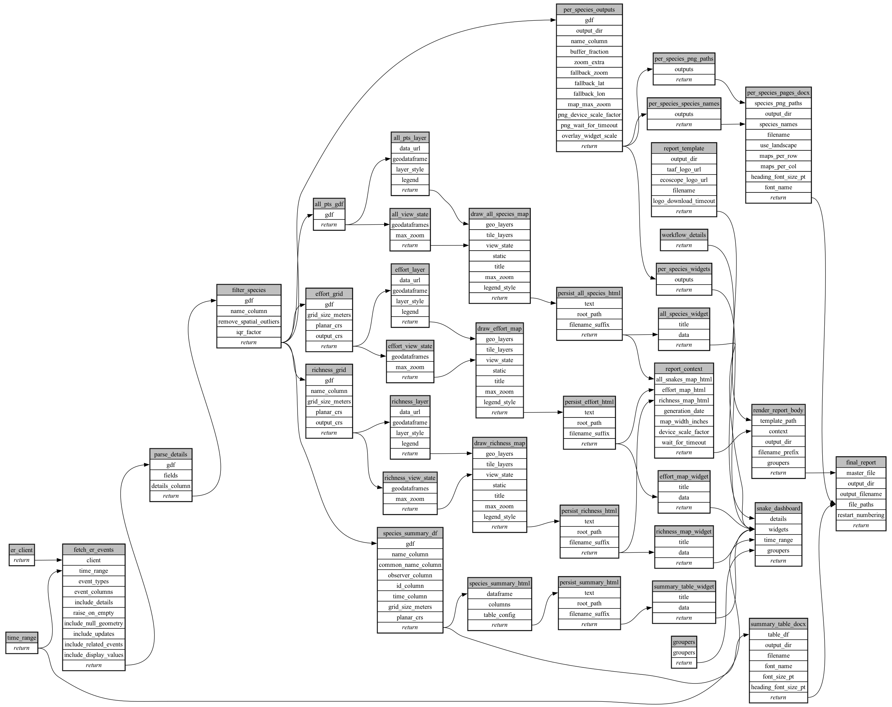

```
# AUTOGENERATED BY ECOSCOPE-WORKFLOWS; see fingerprint in README.md for details

```

```yaml
# fingerprint:
artifacts_sha256_basic: 1b641f518d3869745e5446491a00d48e1b72f00f2e20632a476f3ad3523a1198
artifacts_sha256_strict: 2d3a557e948ebe0e107f13f6951edf5f6a3f5a2105306c147233102b6c1d384c
installed_requirements:
- channel: https://repo.prefix.dev/ecoscope-workflows/
  name: ecoscope-workflows-core
  version: {version: ==0.22.18}
- channel: https://repo.prefix.dev/ecoscope-workflows/
  name: ecoscope-workflows-ext-ecoscope
  version: {version: ==0.22.18}
- channel: https://repo.prefix.dev/ecoscope-workflows-custom/
  name: ecoscope-workflows-ext-custom
  version: {version: ==0.0.28}
- channel: https://repo.prefix.dev/ecoscope-workflows-custom/
  name: ecoscope-workflows-ext-ste
  version: {version: ==0.0.18}
- channel: https://repo.prefix.dev/ecoscope-workflows-custom/
  name: ecoscope-workflows-ext-taff
  version: {version: ==0.0.8}
- channel: conda-forge
  name: pandas
  version: {version: ==2.3.3}
- channel: conda-forge
  name: pandera
  version: {version: ==0.31.1}
- channel: conda-forge
  name: geopandas
  version: {version: ==1.1.3}
- channel: conda-forge
  name: docxtpl
  version: {version: ==0.17.0}
- channel: conda-forge
  name: plotly
  version: {version: ==6.8.0}
- channel: conda-forge
  name: shapely
  version: {version: ==2.1.2}
params_sha256: 1daa2646b5cd19852b3343fc92bf74a60751e596ba94b070c1626685162b736b
spec_sha256: b033fb8d0b2e798900e06dff5d5a14f317004d4acb2272e6082c80ca0526142f

```

# ecoscope-workflows-snake-sightings-workflow


